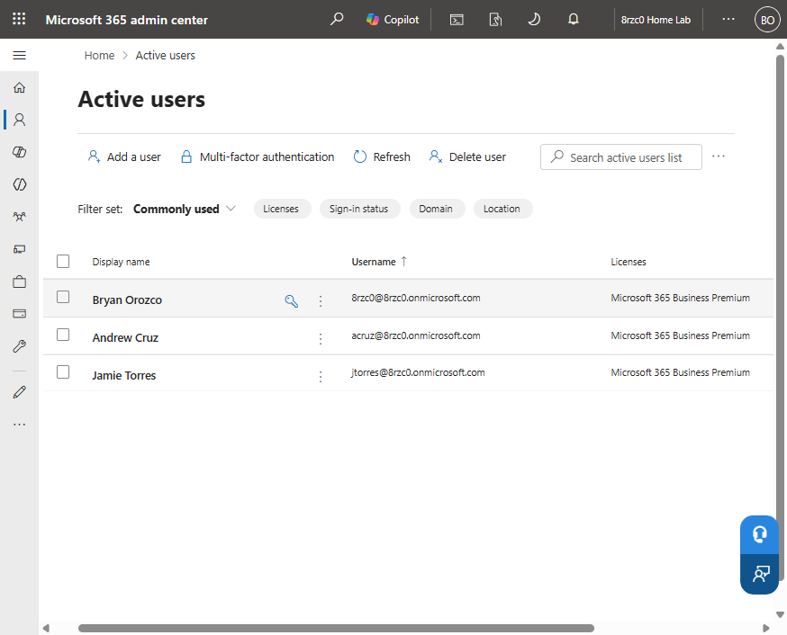
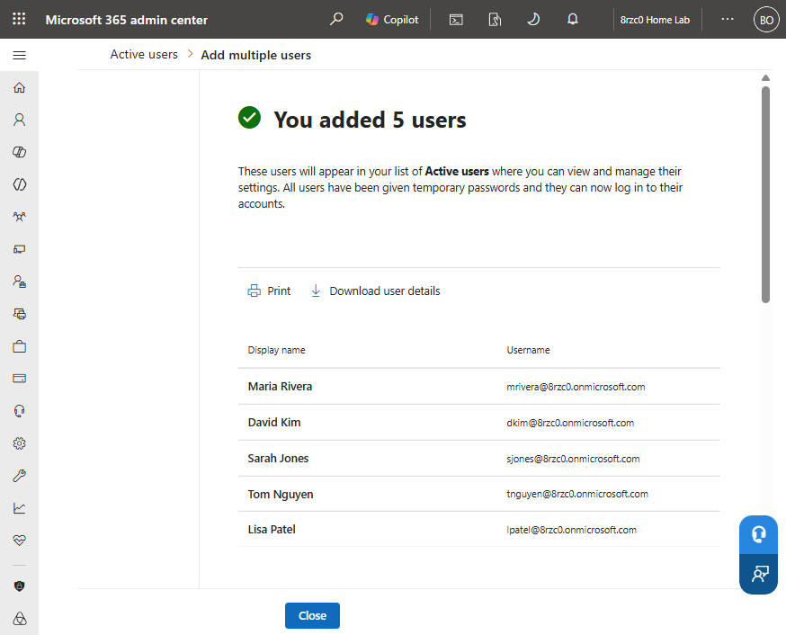
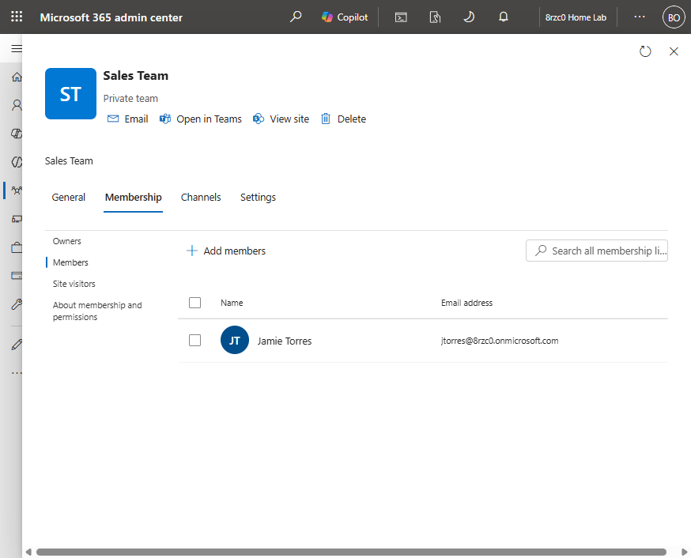
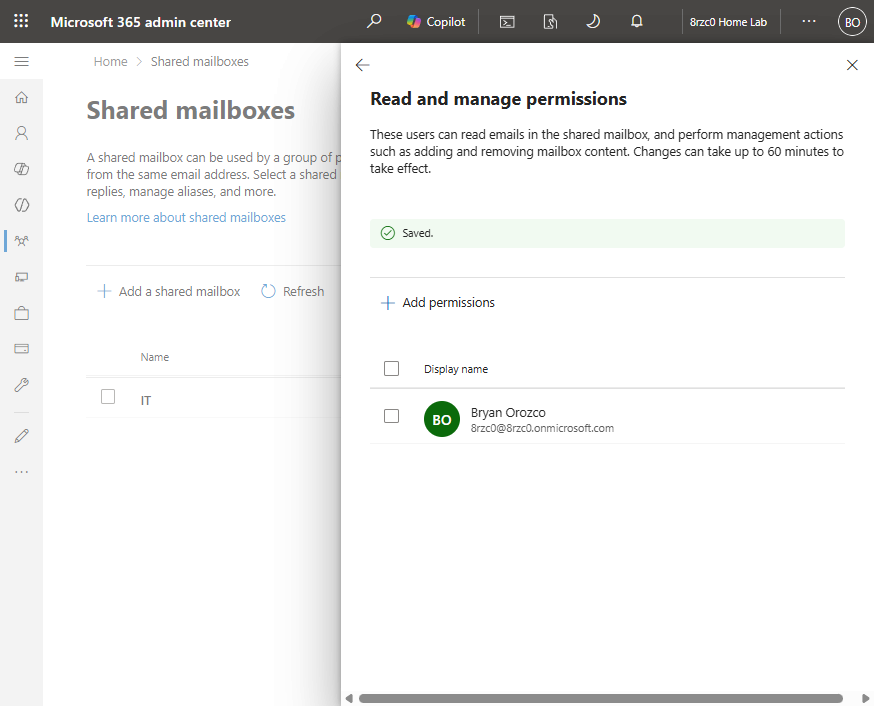
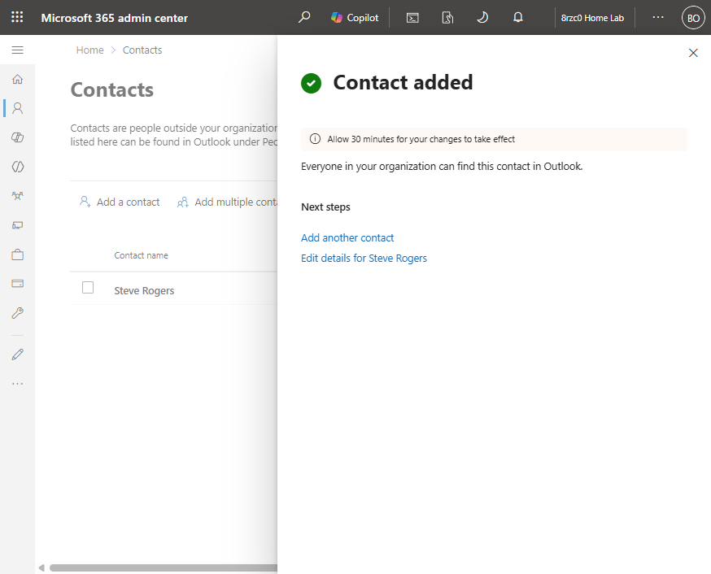
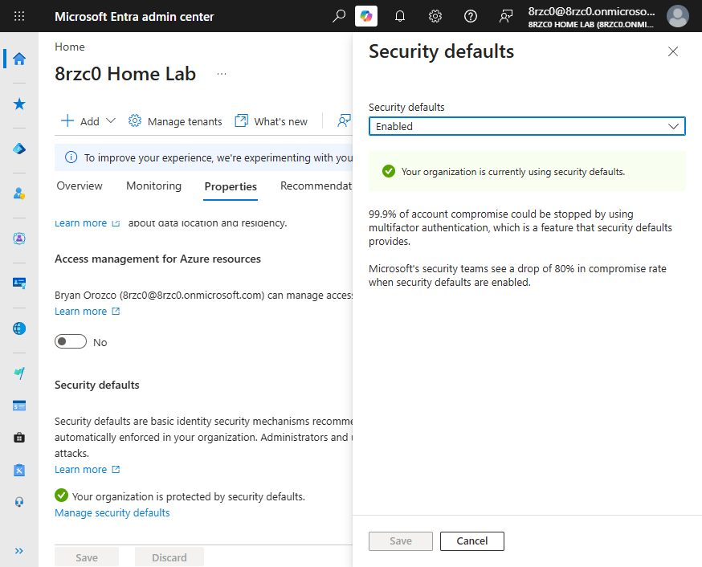
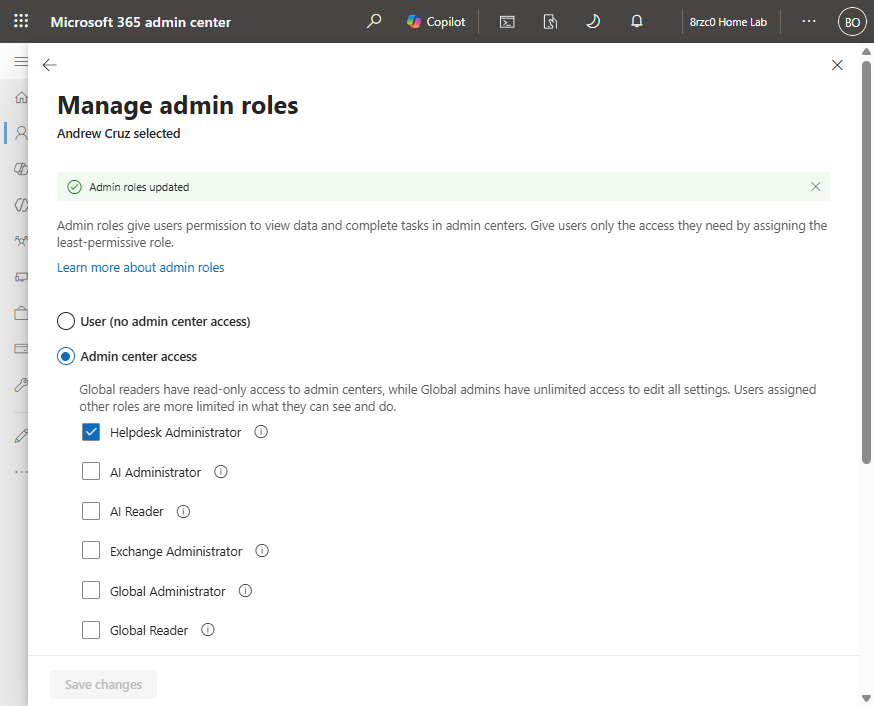
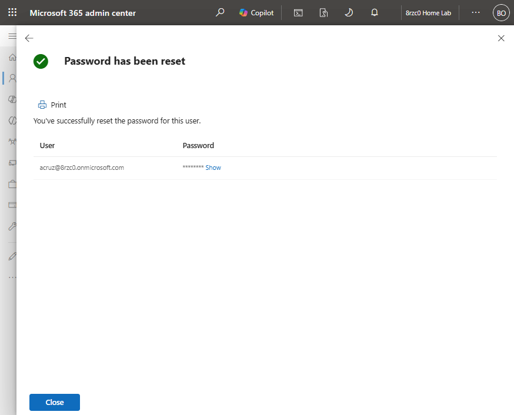

# M365 Admin Center Lab

## Objective

The M365 Admin Center Lab was created to build hands-on experience with Microsoft 365 tenant administration and common Tier 1 IT support tasks. The lab documents practical work in the Microsoft 365 and Microsoft Entra admin centers, including creating and licensing users, bulk provisioning from CSV, managing groups and shared mailboxes, delegating administrative roles, resetting passwords, and enabling tenant-wide MFA.

### Skills Learned

- Created and licensed Microsoft 365 user accounts
- Bulk-provisioned user accounts from the admin center
- Configured a shared mailbox with delegated read access
- Created and populated groups
- Assigned administrative roles to user accounts
- Enabled tenant-wide MFA through Security Defaults
- Performed password resets on domain accounts
- Added contacts to the tenant directory

### Tools Used

- Microsoft 365 Business Premium trial tenant
- Microsoft 365 admin center
- Microsoft Entra admin center
- Admin center CSV bulk-import template

## Environment

|---|---|
| **Tenant** | Microsoft 365 Business Premium trial |
| **Identity** | Microsoft Entra ID, cloud-only |
| **Admin portals** | Microsoft 365 admin center, Microsoft Entra admin center |
| **Objects in tenant** | 8 users, 1 group, 1 shared mailbox, 1 contact |

## Lab Implementation

### User Account Management

Created two licensed user accounts for separate departments through the Microsoft 365 admin center.

*Two licensed users active in the tenant.*

### Bulk Provisioning

Provisioned five additional user accounts in a single operation using the admin center CSV template.

*Five user accounts created from the CSV import.*

### Groups

Created a group for the sales team and added a member.

*Sales group with member assigned.*

### Shared Mailboxes

Created a shared IT mailbox and delegated read access.

*IT shared mailbox with delegated read access.*

### Directory Contacts

Added an external contact to the tenant directory.

*External contact listed in the tenant directory.*

### Multi-Factor Authentication

Enabled Security Defaults through the Microsoft Entra admin center to enforce MFA across the tenant.

*Security Defaults enabled tenant-wide.*

### Role Delegation

Assigned the Help Desk Administrator role to a user account.

*Help Desk Administrator role assigned.*

### Password Reset

Reset the password on an existing user account through the admin center.

*Password reset completed.*

## Outcome

The tenant finished with eight user accounts, all assigned Microsoft 365 Business Premium licenses, a populated sales group, a shared IT mailbox with delegated read access, a directory contact, and MFA enforced tenant-wide through Security Defaults.
